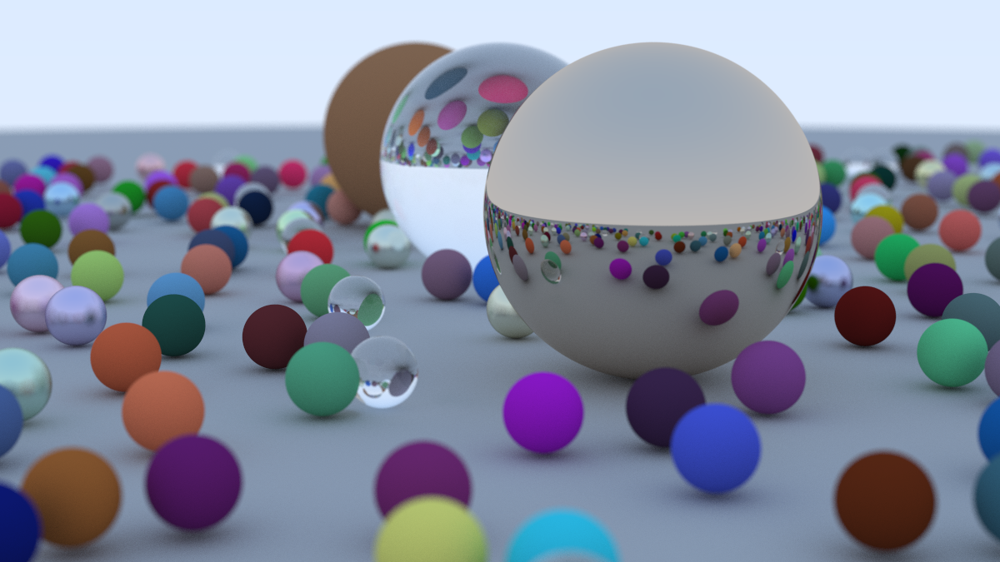

# RayTracingSample
这是一个C++ 编写的光线追踪案例


# 运行方式
构建程序
```shell
cmake --build build --config release
```

运行并将结果输出到 image.ppm 文件
```shell
.\build\Release\RayTracingSample.exe > image.ppm 
```
包含物体过多时，纯cpu执行的追踪算法将极度耗时，请耐心等待。每500像素采样 1200宽度下的单线程耗时达到6000s。

使用ppm工具打开，如果发现格式化错误，请使用转化为utf-8编码格式保存

# 抗锯齿
对采样点周边进行多次随机采样积分，这并不是最好的技术但是一个简单有效的示例。


# 漫反射
漫反射照明遵循兰伯特定律：反射光的强度与表面法线与光线之间的角度的余弦成正比。
散射方向，使用一个与入射点相切的单位球体，随机发送光线。

# 材质
不同材质影响射线
1. 影响发散率
2. 影响衰减

粗糙材质使用漫反射计算发散，类金属材质使用镜面反射计算发散。

# 相机
对于非摄影行家的来说，我这样理解术语。
焦距（focus distance）：相机中心到聚焦平面的距离。在物理相机中，焦距由透镜和胶片/传感器之间的距离控制。
焦长（focal 

## 景深
模拟物理相机的光圈工作对我们来说显得有些复杂，采取一个有效的简化方式。在没有任何模糊的情况下，
场景光线都源自相机中心，接下来将相机中心想象成一个圆面，射线发射源随机在圆面上取值。
当取值为一点时，光线不发散，取值区间越大，光线随距离的增加偏移变得更加明显，从而达到对远处物体的模糊作用。